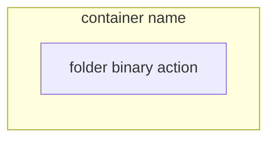
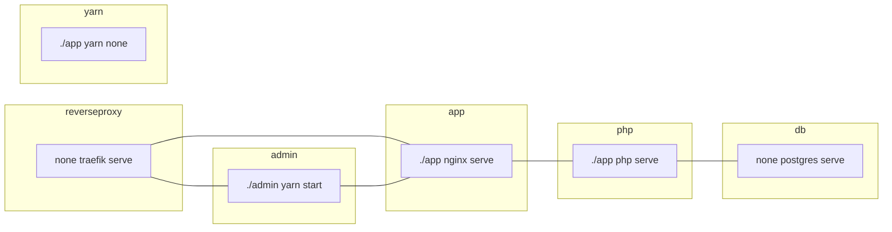

# Ryzen Controller Preset API

## Install development environment

```bash
make install
```

See the [Makefile](blob/master/Makefile#L10) to know what `make install` is doing.

You may need to restart your browser to have a fully working https environment.

### Development architecture description

**Legend:**


**Graph:**

- **yarn**:
  - This allows us to use webpack encore (https://symfony.com/doc/current/frontend.html)
  - More information: https://classic.yarnpkg.com/en/docs
  - Toolset:
    - yarn: `make yarn [install]`
- **reverseproxy**: http://localhost:8080/
  - Traefik: https://docs.traefik.io/v2.0/
  - This allow us to have a working domain `*.ryzencontroller.localhost` with TLS enabled.
- **api**: https://api.ryzencontroller.localhost/
  - The symfony app, using api-platform
  - More information: https://api-platform.com/docs/core/
  - Toolset:
    - composer: `make composer [help]`
    - bin/console: `make console [list]`
    - shell: `make shell [sh]`
- **admin**: https://admin.ryzencontroller.localhost/
  - React-admin: https://marmelab.com/react-admin/Readme.html
  - This allow developers to manage and easily test the API
  - For development purpose only, not intended to be in production
  - Toolset:
    - yarn: `make admin-yarn [help]`
- **db**: tcp://localhost:5432/
  - PostgreSQL: https://www.postgresql.org/docs/
  - The project's database
  - Toolset:
    - psql: `make db-psql [--help]`

# Troubleshoot

> _Using make, I'm getting `--argument not recognize` errors._

If using `--arguments`, you must use make like this: `make -- action --arguments`.
